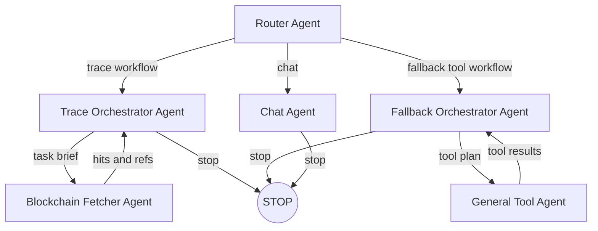

# Blockchain Forensics Multi Agent System
## Background
I want to build a MAS (Multi-Agent System) that can answer any questions about overseas blockchain systems like BTC, ETH, DogeCoin, etc.

In the first version, I aim to implement transaction tracing functionality, especially focusing on cross-chain tracing capabilities.

Methodology: I want this project to follow an iterative evolution approach, avoiding excessive defensive mechanisms, applying Occam's Razor principle - starting from a minimal working version and gradually evolving.

## Technical Choices
- Use LangGraph
- Static Agents
- Static Workflow
- Orchestrator-centered single-thread scheduling
- v0: No memory for now
- v0: No storage for now; all needed data stored in state
- Frontend: Preferably an interactive chatbox for debugging, but not a priority; CLI is acceptable
- Agent design: Should be robust, especially agents with tool calls can have internal self-check loops, with a reasonable retry limit (configurable in config). Can reference multi-node agent patterns. If loops involve Agent decision logic (tool selection, memory reads), use multi-node; if just low-level technical retries, handle within the node.

## Core Data Structure

1. Reference Rosetta protocol's transaction abstraction
2. Main components:
   1. TxLocator - for locating native transactions
   2. Transfer - internal and GraphState transaction abstraction, compatible with both UTXO and Account-based chains
   3. CrossChainLink - for marking cross-chain structures (self-contained with Transfer references)
   4. EvidenceRef - for recording where TxLocator was obtained

```py
from __future__ import annotations

from dataclasses import dataclass, field
from typing import Any, Dict, List, Literal, Optional


TxStatus = Literal["confirmed", "mempool", "dropped"]
TransferType = Literal["utxo", "account"]


@dataclass(frozen=True)
class TxLocator:
    """Canonical on-chain locator (facts)."""
    chain: str                 # e.g. "BTC", "DOGE", "ETH"
    txid: str                  # tx hash / id (string)
    status: TxStatus = "confirmed"
    block_height: Optional[int] = None
    block_hash: Optional[str] = None
    block_time: Optional[int] = None  # unix seconds


@dataclass(frozen=True)
class EvidenceRef:
    """How/where you retrieved the raw data for a locator (audit/replay)."""
    source: str                       # e.g. "blockcypher", "blockchair", "electrs"
    locator: Optional[TxLocator] = None
    retrieved_at: int = 0             # unix seconds
    raw_pointer: str = ""             # file path / object key / db id
    metadata: Dict[str, Any] = field(default_factory=dict)


@dataclass(frozen=True)
class AccountIdentifier:
    """Rosetta-style account identifier."""
    address: Optional[str]
    metadata: Dict[str, Any] = field(default_factory=dict)


CoinAction = Literal["coin_created", "coin_spent"]


@dataclass(frozen=True)
class CoinChange:
    """UTXO-only: identifies discrete coin lifecycle changes."""
    coin_id: str              # "txid:vout" (created) or "prev_txid:prev_vout" (spent)
    action: CoinAction


@dataclass(frozen=True)
class Operation:
    """Rosetta-style operation: one account/coin state change.
    - Account-based chains: use account + signed amount (coin_change usually None)
    - UTXO chains: coin_change anchors coin continuity

    Amount is always in human-readable units (e.g., 1.5 BTC, not satoshis).

    op_id naming convention:
    - UTXO: "vin:N", "vout:N"
    - Account native: "v:0" (internal: "v:1", "v:2" for future)
    - Account ERC20: "e:N" where N = log index

    Note: CrossChainLink uses op_idx (array index into Transfer.operations) for precise lookup.
    For Account chains, one op_id maps to TWO operations (in/out with opposite amounts).
    """
    op_id: str                          # semantic id; e.g. "vin:0", "vout:2", "v:0", "e:3"
    account: AccountIdentifier
    amount: Optional[float] = None      # signed amount in human-readable units
    asset: Optional[str] = None         # e.g. "BTC", "ETH", "USDC"
    decimals: Optional[int] = None      # precision for this asset (e.g., 8 for BTC, 18 for ETH)
    coin_change: Optional[CoinChange] = None


@dataclass
class Transfer:
    """Transaction-level transfer group.
    Essentially Rosetta Transaction semantics: a group of operations for one on-chain tx.
    """
    id: str                                        # usually == txid
    locator: TxLocator
    operations: List[Operation]
    type: TransferType                             # "utxo" for BTC/DOGE/LTC, "account" for ETH/etc.
    evidence_refs: List[EvidenceRef] = field(default_factory=list)


@dataclass
class CrossChainLink:
    """Inference edge between two chains' operations.

    Price Direction: 1 src_coin = [price_min, price_max] dst_coin (raw, no buffer)
    """
    id: str

    # Source/Destination operation references (op_idx into Transfer.operations)
    src_transfer: Transfer
    src_op_idx: int
    dst_transfer: Transfer
    dst_op_idx: int

    # Price range at src tx time (raw, no buffer)
    price_min: Optional[float] = None
    price_max: Optional[float] = None

    # Computed during scoring
    time_diff: Optional[int] = None
    fee_rate_min: Optional[float] = None
    fee_rate_max: Optional[float] = None

    # Exclusion
    excluded: bool = False
    exclude_reason: Optional[str] = None

    # Scores (0..1)
    f_time: float = 0.0
    f_amount: float = 0.0
    confidence: float = 0.0

    evidence_refs: List[EvidenceRef] = field(default_factory=list)

```

## Chain Identifiers

Internal simplified identifiers, rules:
1. Format: `<CHAIN>` or `<CHAIN>-<network>` (testnet or specific network)
2. Use uppercase abbreviations, prefer common ticker symbols
3. Use `-` as separator

**Examples**:
- `BTC` - Bitcoin mainnet
- `BTC-test` - Bitcoin testnet
- `ETH` - Ethereum mainnet
- `ETH-sepolia` - Ethereum Sepolia testnet
- `DOGE` - Dogecoin
- `MATIC` - Polygon
- `ARB` - Arbitrum

## State schema

```python
from typing import TypedDict, List, Dict, Any, Optional
from langchain_core.messages import BaseMessage


class PlanStep(TypedDict):
    id: str            # stable step id, e.g. "fetch_btc_tx"
    owner: str         # agent name, e.g. "fetcher"
    desc: str          # short instruction


class Plan(TypedDict):
    iter: int          # replan counter
    cursor: int        # current step index
    steps: List[PlanStep]


class ErrorEvent(TypedDict, total=False):
    t: str             # ISO timestamp
    where: str         # node / agent / tool name
    msg: str           # 1-line summary
    retry: int         # optional
    data: Any          # optional small payload

Subgraph = Literal["chat", "blockchain", "tool"]


class BlockchainState(TypedDict, total=False):
    transfers: Dict[str, Dict[str, Transfer]] # transfer data [chain][transfer_id]
    cclinks: List[CrossChainLink]             # cross-chain links

class SubgraphExecState(TypedDict, total=False):
    plan: Plan
    errors: List[ErrorEvent]

class GraphState(TypedDict, total=False):
    # identity / session
    thread_id: str

    # conversation (shared thread)
    messages: List[BaseMessage]

    # cache for deterministic tools: [tool][args_hash] -> result
    tool_cache: Dict[str, Dict[str, Any]]
    # readability / debug only: args_hash -> original args
    tool_cache_args: Dict[str, Any]

    # domain state
    blockchain: BlockchainState

    # per-subgraph control
    trace: SubgraphExecState
    fallback: SubgraphExecState

    # no memory in v0, add later
    # memory retrieval result (ephemeral, per-iteration)
    # memory_context: Any
```

## Workflow



## Agents

### Router Agent

- Does not modify state, only returns routing decision
- Structured output: enforced at code layer via `with_structured_output()`
- System prompt:
```
You are the Router Agent. Your sole responsibility is to route the user input to one of three options: `trace`, `fallback`, or `chat`.

Rules (in priority order):
1) If the user input is about blockchain analysis, such as tracing, forensics, cross-chain linkage, transaction attribution, fund flow provenance, or contains txhash/address/chain/bridge-like indicators, choose `trace`.
2) If the input requires external information or tool usage but is not clearly a blockchain tracing task, choose `fallback`.
3) Otherwise, choose `chat`.

Do not call any tools. Do not answer the user question. Do not modify any state.
```

- Return structure:
```python
class RouterOutput(TypedDict):
    route: Literal["trace", "fallback", "chat"]
    why: str   # ≤25 words
```

---

### Trace Orchestrator Agent

- Responsibility: Control the trace workflow, manage Plan, direct Fetcher, integrate results into BlockchainState
- Readable state: `messages`, `trace.plan`, `trace.errors`, `blockchain`
- Writable state: `trace.plan`, `trace.errors`, `blockchain.transfers`, `blockchain.cclinks`
- Structured output: enforced at code layer via `with_structured_output()`

- System prompt:
```
You are the Blockchain Trace Orchestrator Agent. You control the static tracing workflow for blockchain forensics and attribution tasks. You do not call external tools directly; instead, you issue task briefs to the Trace Fetcher Agent and reason over the returned evidence.

## Your Responsibilities
1) Interpret the user objective and current `state.blockchain` (existing transfers and cclinks).
2) Manage the execution plan via `state.trace.plan` (update cursor, add/remove steps as needed).
3) Produce a clear, executable `task_brief` for the Trace Fetcher.
4) Receive FetchReport from Fetcher, normalize findings into Transfer objects, and merge into `state.blockchain.transfers`.
5) Identify cross-chain links and append to `state.blockchain.cclinks`.
6) Decide to continue (issue next task) or stop (return final answer).

## State Update Rules
- `state.trace.plan`: Update `cursor` to current step index; increment `iter` on replan; modify `steps` if strategy changes.
- `state.blockchain.transfers`: Dict[chain][transfer_id] -> Transfer. Merge new transfers; do not overwrite existing unless correcting.
- `state.blockchain.cclinks`: Append new CrossChainLink objects when cross-chain relationships are identified.
- `state.trace.errors`: Append ErrorEvent if Fetcher reports fatal gaps or you detect logical inconsistencies.

## Principles
- Be goal-driven and convergent.
- Every conclusion must cite reproducible evidence (via TxLocator or EvidenceRef).
- For non-unique notions (e.g., account-based provenance), explicitly state the heuristic used.
- When Fetcher returns gaps, decide: retry with refined task, or record as error and proceed.
```

- Return structure:
```python
class TaskWant(TypedDict, total=False):
    k: int
    kinds: List[Literal["tx", "event", "address"]]

class CandidateOutput(TypedDict):
    txid: str
    chain: str
    op_id: str
    amount: float
    price_min: float
    price_max: float

class DestInfo(TypedDict):
    txid: str
    chain: str
    op_id: str
    amount: float

class TraceOrchestratorOutput(TypedDict):
    action: Literal["continue", "stop"]
    # if continue
    task_brief: Optional[str]
    want: Optional[TaskWant]
    # if stop - structured data for scoring
    candidates: Optional[List[CandidateOutput]]
    dest_info: Optional[DestInfo]
    stop_reason: Optional[str]  # ready_for_scoring, no_candidates, tool_failure
```

---

### Trace Fetcher Agent

- Responsibility: Call blockchain data tools based on task_brief, return structured findings
- Readable state: `tool_cache`, `blockchain` (for context)
- Writable state: `tool_cache`, `trace.errors`
- Tools: blockchain explorer APIs (see blockchain_explorer_apis.md)
- Structured output: enforced at code layer via `with_structured_output()`, returns `FetchReport`

- System prompt:
```
You are the Trace Fetcher Agent. You act as an autonomous investigator that uses blockchain data tools to gather evidence in response to a task brief from the Orchestrator.

## Your Responsibilities
1) Parse the task_brief to understand what evidence is needed.
2) Select appropriate blockchain data tool(s) and construct queries.
3) Execute tool calls; on transient failure (timeout, rate limit), retry internally.
4) On persistent failure, record to `state.trace.errors` and report in `gaps`.
5) Normalize raw API responses into structured Finding objects aligned with core data structures (TxLocator, Transfer, Operation, etc.).
6) Return FetchReport to Orchestrator.

## Principles
- Return only top-k most relevant hits (default k ≤ 5 unless specified).
- Each finding must include reproducible evidence (source, endpoint, params).
- Normalize amounts to smallest units (satoshi, wei) as strings.
- Use CAIP-2 chain identifiers: "BTC", "DOGE", "ETH", etc.
- Do not make judgments about cross-chain links; only report raw findings.
```

- Return structure:
```python
class SourceRef(TypedDict, total=False):
    source: str       # e.g. "blockcypher" / "sochain"
    endpoint: str     # e.g. "get_transaction"
    params: str       # e.g. "tx=0x..." / "addr=0x..."

class Finding(TypedDict):
    kind: Literal["tx", "event", "address"]
    id: str           # txhash / event-id / address
    rationale: str    # 1-line explanation
    data: List[SourceRef]  # 1-3 refs enough

class FetchReport(TypedDict):
    task: str               # echoed task brief
    findings: List[Finding] # best-first, top-k
    gaps: List[str]         # optional, unresolved issues
```

---

### Fallback Orchestrator Agent

- Responsibility: Handle tasks that are not trace-type but require tools
- Readable state: `messages`, `fallback.plan`, `fallback.errors`, `tool_cache`
- Writable state: `fallback.plan`, `fallback.errors`
- Structured output: enforced at code layer via `with_structured_output()`

- System prompt:
```
You are the Fallback Orchestrator Agent. You handle tasks that require general tool usage but do not match the static blockchain tracing workflow. You coordinate a loop with the General Tool Agent.

## Your Responsibilities
1) Interpret the user request and current state.
2) Manage execution plan via `state.fallback.plan`.
3) Produce a concrete `tool_plan` for the General Tool Agent.
4) Evaluate Tool Agent's results against the plan.
5) Refine the plan or stop with an answer.

## State Update Rules
- `state.fallback.plan`: Update `cursor`, `iter`, and `steps` as needed.
- `state.fallback.errors`: Append if Tool Agent reports persistent failures.
- Do NOT write to `state.blockchain`; if you detect this is actually a blockchain tracing task, indicate redirect to trace workflow.

## Principles
- Converge quickly; each plan iteration should be more specific.
- Cite sources returned by the Tool Agent.
- If task seems blockchain-related, redirect to trace workflow.
```

- Return structure:
```python
class FallbackOrchestratorOutput(TypedDict):
    action: Literal["continue", "stop", "redirect"]
    # if continue
    tool_plan: Optional[str]                  # instruction for Tool Agent
    want: Optional[List[str]]                 # expected information items
    # if stop
    answer_text: Optional[str]                # final answer to user
    sources: Optional[List[str]]              # cited sources
    # if redirect
    redirect_to: Optional[Literal["trace"]]
    reason: Optional[str]
```

---

### General Tool Agent

- Responsibility: Execute the Fallback Orchestrator's tool_plan
- Readable state: `tool_cache`
- Writable state: `tool_cache`, `fallback.errors`
- Tools: general purpose tools (web search, etc.)
- Structured output: enforced at code layer via `with_structured_output()`, returns `ToolReport`

- System prompt:
```
You are the General Tool Agent. You execute the Fallback Orchestrator's tool plans by calling external tools (web search, APIs, etc.) and return structured results.

## Your Responsibilities
1) Parse the tool_plan to understand what information is needed.
2) Execute tool calls; retry transient failures internally.
3) On persistent failure, report in gaps.
4) Summarize findings concisely with sources.

## Principles
- Follow the plan strictly; only fill gaps when necessary.
- Provide sources suitable for citation.
- Explicitly note uncertainty or conflicting information.
- Keep results concise; do not dump raw data.
```

- Return structure:
```python
class ToolResult(TypedDict):
    item: str         # what was found
    source: str       # where it came from

class ToolReport(TypedDict):
    task: str                # echoed tool plan
    results: List[ToolResult]
    sources: List[str]
    gaps: List[str]
```

## Error Handling

### 1. Which errors are retryable? Which should fail immediately?

**Retryable Errors**
- Transient external dependency errors
  - Blockchain explorer / RPC timeout
  - API rate limit / 5xx
  - Price, exchange rate API temporarily unavailable
- Non-deterministic parsing failures
  - Explorer returns changed structure but has fallback
  - LLM tool call format error (can auto-fix prompt / schema)
- Search space not converged
  - Time window too narrow / too wide
  - Amount matching has no candidates (can auto-relax constraints)

**Fatal Errors**
- Data semantics invalid
  - Transaction doesn't exist / hash invalid
  - Chain not supported / explorer unavailable
- Logical preconditions not met
  - Cross-chain analysis but no bridge / exchange / mixer traces found
  - Tracing target is coinbase / genesis
- Budget or strategy termination
  - Exceeded hop / depth / time / cost limits
  - Explicitly marked as "trace-end" by policy

### 2. Should retry logic be inside Agent or at Orchestrator level?

Recommended layered approach (critical for MAS):

**Inside Agent (local, deterministic)**
- Tool-level retry
  - API retry, fallback explorer
  - Schema fix, parameter tweaks
- Does not change global search strategy
- Does not create new branches
→ Goal: Let Agent "finish what it's supposed to do"

**Orchestrator Level (global, strategic)**
- Decides whether to:
  - Relax / tighten heuristic rules
  - Switch analysis path (bridge → exchange → mixer)
  - Rollback a subgraph, try alternative hypothesis
- Manages:
  - Retry budget
  - Branch explosion
  - Confidence degradation threshold
→ Goal: Control overall search space and compute cost

**Summary:**
Agent handles "fixing bugs",
Orchestrator handles "changing strategy".

---

### 3. Loop Exit Conditions

**Trace Fetcher Agent (tool call layer)**
```python
MAX_TOOL_RETRIES = 3  # see config.py
for attempt in range(MAX_TOOL_RETRIES):
    try:
        result = call_blockchain_api(...)
        break  # ✅ Success
    except (Timeout, RateLimitError) as e:
        if attempt == MAX_TOOL_RETRIES - 1:
            # ❌ Exceeded retry count, record to state.trace.errors
            state.trace.errors.append(ErrorEvent(...))
            raise
        backoff = TOOL_RETRY_BACKOFF_BASE ** attempt
        time.sleep(backoff)
    except (TxNotFoundError, InvalidHashError) as e:
        # ❌ Fatal error, fail immediately, no retry
        state.trace.errors.append(ErrorEvent(...))
        raise
```

Exit conditions:
- ✅ Tool call succeeded
- ❌ Exceeded `MAX_TOOL_RETRIES`
- ❌ Encountered Fatal Error (tx not found, invalid hash)

**Trace Orchestrator (decision layer)**
```python
TRACE_MAX_ITERATIONS = 10  # Maximum iterations
TRACE_MAX_DEPTH = 5        # Maximum cross-chain hops
TRACE_ERRORS_WARNING = 50  # Error warning threshold

# Check before each iteration
if state.trace.plan.iter >= TRACE_MAX_ITERATIONS:
    return TraceOrchestratorOutput(action="stop", answer_text="Reached maximum iterations")

if len(state.blockchain.cclinks) >= TRACE_MAX_DEPTH:
    return TraceOrchestratorOutput(action="stop", answer_text=f"Traced {TRACE_MAX_DEPTH} hops")

if len(state.trace.errors) > TRACE_ERRORS_WARNING:
    if should_abort_due_to_errors(state.trace.errors):
        return TraceOrchestratorOutput(action="stop", answer_text="Too many errors, task terminated")

if no_new_findings_in_last_N_iterations(state, N=2):
    return TraceOrchestratorOutput(action="stop", answer_text="No new findings")
```

Exit conditions:
- ✅ User question answered (high confidence)
- ✅ Reached budget limit (`TRACE_MAX_ITERATIONS` / `TRACE_MAX_DEPTH`)
- ✅ No new findings (no progress for N consecutive iterations)
- ✅ Too many errors (exceeded `TRACE_ERRORS_WARNING` and unrecoverable)
- ❌ Encountered trace-end (coinbase / genesis / mixer)

**Fallback Orchestrator (general tool layer)**
```python
FALLBACK_MAX_ITERATIONS = 8

if state.fallback.plan.iter >= FALLBACK_MAX_ITERATIONS:
    return FallbackOrchestratorOutput(action="stop", answer_text="Reached maximum iterations")

if plan_satisfied(state):
    return FallbackOrchestratorOutput(action="stop", answer_text="Task objective completed")
```

Exit conditions:
- ✅ Task objective achieved
- ✅ Reached `FALLBACK_MAX_ITERATIONS`
- ✅ Detected should redirect to trace workflow

---

### 4. Error Accumulation & Compression

**v0 Strategy: Soft limit + Warning (no active compression)**

```python
TRACE_MAX_ERRORS = 100         # Soft limit
TRACE_ERRORS_WARNING = 50      # Warning threshold

# Check in Orchestrator
if len(state.trace.errors) > TRACE_ERRORS_WARNING:
    logger.warning(f"Error count: {len(state.trace.errors)}, consider adjusting strategy")
```

v0 **does not do auto-compression**, keeping errors atomic for debugging.

**v1+ Strategy: LLM Smart Compression (for memory)**

Add `ErrSummaryNode` in v1, when errors exceed `MAX_ERRORS`:
1. Keep the most recent K errors (e.g., 20)
2. Pass old errors to LLM for smart summarization, generating:
   - Error pattern recognition
   - Root cause analysis
   - Strategy adjustment suggestions
3. Replace with: `[summary_event] + recent_errors`

Benefits:
- ✅ Maintains semantic completeness (LLM understands causal relationships)
- ✅ Consistent with memory mechanism (summary can enter long-term memory)
- ✅ Guides strategy adjustment

When to clean up:
- When task ends
- Clear corresponding `SubgraphExecState.errors` after each subgraph completes

---

## Configuration

**v0: Use separate `config.py`**

Reasons:
- ✅ Simple and direct, easy to manage
- ✅ Doesn't occupy state space
- ✅ Git-friendly, easy version control
- ✅ Meets v0 needs (no runtime modification required)

**v1+: Optional `ConfigState`** (if runtime dynamic modification needed)

```python
# See separate config.py file below for example
```

---

## Deliverables
File list + How to run + A minimal demo (given a BTC tracing task with txhash, can run through trace loop, successfully call correct tool, give a conclusion)

Example data: see example_data.md
